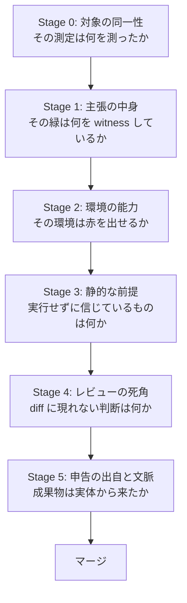

# 検証ナレッジの体系 — 「できました、緑です」を疑う順番

## なぜこの体系が要るのか

AI コーディングエージェントによる開発では、**実装した本人(エージェント)が検証も行い、その報告を書く**。人間のチームで暗黙に分かれていた「作る人 / 検証する人 / 報告を読む人」が1つのコンテキストに畳まれ、しかも報告は常に流暢で確信的である — **確信の強さと正しさが相関しない**環境で、報告の検証そのものが独立した工程になる。

さらに条件が3つ重なる: 生成速度が人間のレビュー速度を上回る。実装者が自分のテスト(=自分の採点基準)も書く。複数のエージェントが同一リポジトリ・共有環境で並行作業する。この4条件が、人間チームでは稀にしか起きない失敗形 — **自己過信の工業的な量産** — を日常にする。本ディレクトリの23ドキュメントは、その失敗の実測記録から抽出した対処の体系である。

## パイプライン — 完了報告を受けてからマージ(merge = 変更の取り込み)まで

23本は「疑う順番」の1本のパイプラインに配置できる。上流ほど、そこが壊れていると下流の検証がすべて無意味になる。

### Stage 0 — 対象の同一性: その測定は何を測ったか

検証の最上流。ここがずれていると、以降のすべての緑・赤が別の対象についての主張になる。

- [測定対象のずれ](measurement-target.ja.md) — 「測っていない」より「測ったが対象がずれていた」が危険。測る前に「この測定は決定が必要とするものを覆うか」
- [strip 計測器自体の健全性](strip-instrument-integrity.ja.md) — anchor 非一意・重複宣言・別ツリー測定・負荷。計測器が壊れていれば結論は出ない
- [検証ラン自体の生存確認](verification-run-liveness.ja.md) — 「遅い」と「止まっている」は別の状態。読んでいないランの進捗を報告しない

### Stage 1 — 主張の中身: その緑は何を witness しているか

テストが「ある」ことと、性質が「守られている」ことの間の距離。(witness〈証人〉= その性質が壊れたら RED〈失敗〉になるテストで検知していること。)

- [緑を読む技術](green-reading.ja.md) — 「rc=0 / N passed」は何が走ったかを言わない。skip は緑。証人は実行されたか・どのコードか・本当に終わったか
- [strip 反証の規律](strip-falsification.ja.md) — RED 報告を証拠に変える4軸(網羅・最小破壊・成立確認・機構丸ごと殺し)
- [テストの偽物は本物の形に合わせる](test-doubles.ja.md) — fake・fixture・None・既定値・代理検査が作る見せかけの被覆
- [配線テストと機構テスト](wiring-vs-mechanism.ja.md) — 「機構が正しい」と「production が機構に到達する」は別の assert
- [空虚なゲートの生まれ方](vacuous-gates.ja.md) — 終端のみ assert・別経路の positive control・散文だけの性質
- [修正は生きた経路で証明する](fix-verification-live-path.ja.md) — 病名・単独ゲート・実装者テストは代理。オーナーが踏んだ経路で反証する
- [復旧の源は破壊を生き残るか](recovery-truncation.ja.md) — 往復の緑では足りない。truncate 反証を必須ゲートに

### Stage 2 — 環境の能力: その環境は赤を出せるか

個々のテストが健全でも、実行環境そのものが欠陥を表出できない形がある。

- [検証環境の構造的盲目](environment-blindness.ja.md) — ゲートが仮定を witness できるのは、環境が仮定の語る環境と異なるときだけ
- [正常系の外を踏む](beyond-happy-path.ja.md) — エラー経路・実行時の不正入力・画面全体。正常系の緑だけで PASS にしない

### Stage 3 — 静的な前提: 実行せずに信じているものは何か

コードを読んだだけの主張・宣言・記述をどう扱うか。

- [census と structure](census-vs-structure.ja.md) — 「今日そうである」と「そうであるように作られている」の判別と、census 前提の安全な使い方
- [列挙の規律](enumeration-discipline.ja.md) — 完全性の主張が切り詰め(出力・クエリ・面の定義)で死ぬ形
- [生死は producer で判定する](liveness-is-producer.ja.md) — 宣言・ドキュメント・名前は「意図の記録」。挙動を記録するのは producer(データを書く側)だけ
- [監査は内容を照合する](audit-content-match.ja.md) — シンボルの存在は稼働の証拠にならず、行番号の一致は主張の証拠にならない
- [削除の検証](removal-verification.ja.md) — 「死んでいる」は反証すべき主張。producer と reader の全列挙、import 緑≠runtime 緑、不在の assert

### Stage 4 — レビューの死角: diff に現れない判断は何か

- [一括修正 PR のレビュー](sweep-reviews.ja.md) — 「触らなかった」も判断であり、diff に現れない
- [fix-class レビュー](fix-class-review.ja.md) — 「壊さないか」と「同病はいないか」は別の問い
- [共有ヘルパーの意味論拡大](shared-helper-widening.ja.md) — 統合が黙って意味論を広げる。誰も否定形を assert していない
- [やり残しは欠陥の発見を遅らせる](incomplete-work.ja.md) — 未完了は「まだ」と「終わった」の区別が外から付かない。残余は可視のチェックリストに

### Stage 5 — 申告の出自と文脈: 成果物は実体から来たか、主張はどの文脈で計算されたか

- [fixture の出自を証明する](fixture-provenance.ja.md) — 「録り直した」を申告でなく対応関係で確かめる。「既存の失敗」は観測でのみ確定する
- [文脈を持たない主張](cross-context-claims.ja.md) — 助言・委任監査・完了報告は、持っていない文脈を明示するか、その持ち主の承認をゲートにする

## 横断する4つの原理

パイプラインのどの段にも、同じ原理が形を変えて現れる。個別の規則を忘れても、この4つから再導出できる。

### 原理1 — 緑は多義である

緑は「検査して正しかった」「そもそも見ていない」「実験が成立していない」を区別しない。skip(実行を飛ばしたテスト)は緑に見え、未変更は検査済みに見え、当たらなかった strip は健全に見える。**緑を根拠に使うときは、その緑がどの意味かを特定してから使う。**
(→ [strip 反証](strip-falsification.ja.md)軸3、[空虚なゲート](vacuous-gates.ja.md)、[一括修正 PR](sweep-reviews.ja.md))

### 原理2 — 意図の記録と挙動の記録

スキーマ・ドキュメント・コメント・宣言・名前は「誰かが意図したこと」の記録であり、挙動については何も証言しない。挙動を記録するのは producer(データを書く側)・実行・計測だけ。**意図の記録から挙動を推論したら、その推論には READ(出典を読んだ)/ INFERRED(推論した)のラベルを貼り、MEASURED(実測した)と混ぜない。**
(→ [生死は producer](liveness-is-producer.ja.md)、[census と structure](census-vs-structure.ja.md)、[配線テストと機構テスト](wiring-vs-mechanism.ja.md))

### 原理3 — 検証は自分がサンプルした定義域しか守らない

チェックは触れた形状だけ、テストは走った環境だけ、grep は投げた軸だけを守る。**「検証済み」という言葉には、必ず定義域(どの形状・どの環境・どの軸)を添える。** 定義域の外への一般化が、すべての「緑のまま壊れる」の入口である。
(→ [census と structure](census-vs-structure.ja.md)、[検証環境の構造的盲目](environment-blindness.ja.md)、[列挙の規律](enumeration-discipline.ja.md))

### 原理4 — 注意力ではなく手順

同じ人が同じ日に、手順を踏んだ検証では当て、踏まなかった検証では外した記録が複数ある。再現するのは「良い判断」ではなく「挟まった手順」である。**規律はチェックリスト・依頼テンプレート・レジストリ(登録簿)導出ゲートの形に落とし、注意力に依存する形で残さない。**
(→ [測定対象のずれ](measurement-target.ja.md)、[列挙の規律](enumeration-discipline.ja.md)、[strip 計測器の健全性](strip-instrument-integrity.ja.md))

## 立場別の読む順

coder / tester / reviewer を別エージェントに分ける運用(現在の AI コーディングの標準構成)では、[役割分離運用の実務](roles.ja.md)が本体系を役割ごとの義務 — coder の報告契約・tester の反証メニュー・reviewer の独立検証と指示の非対称・マージゲートの3規則 — に組み直している。そちらを入口にしてよい。

- **実装する側(エージェント本人、または実装を依頼する人)**: [strip 反証](strip-falsification.ja.md) → [配線テスト](wiring-vs-mechanism.ja.md) → [修正は生きた経路で](fix-verification-live-path.ja.md) → [fixture の出自](fixture-provenance.ja.md) → [やり残し](incomplete-work.ja.md)。自分の報告を証拠付きにする技術。
- **レビュー・co-vet(独立第二検証)する側**: [一括修正 PR](sweep-reviews.ja.md) → [fix-class レビュー](fix-class-review.ja.md) → [正常系の外](beyond-happy-path.ja.md) → [共有ヘルパー](shared-helper-widening.ja.md) → [監査は内容を照合する](audit-content-match.ja.md) → [strip 計測器](strip-instrument-integrity.ja.md)。diff と報告の外側を見る技術。
- **検証系・CI を設計する側**: [検証環境の盲目](environment-blindness.ja.md) → [census と structure](census-vs-structure.ja.md) → [生死は producer](liveness-is-producer.ja.md) → [復旧と切り詰め](recovery-truncation.ja.md) → [列挙の規律](enumeration-discipline.ja.md)。ゲートを置く場所と形を決める技術。
- **エージェント同士の協働を設計する側**: [文脈を持たない主張](cross-context-claims.ja.md) → [測定対象のずれ](measurement-target.ja.md) → [検証ランの生存確認](verification-run-liveness.ja.md)。境界を越える主張と報告の規律。
