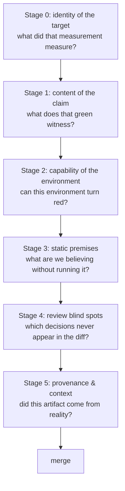

# The System of Verification Knowledge — the Order in Which to Doubt "Done, All Green"

## Why this system is needed

In development performed by AI coding agents, **the same party that implements a change also verifies it and writes the report**. The roles that a human team implicitly separates — builder, verifier, reader of the report — collapse into one context. And the reports are invariably fluent and confident: **confidence does not correlate with correctness**, so verifying the report becomes an engineering step of its own.

Three more conditions stack on top: generation speed exceeds human review speed; the implementer writes its own tests (its own grading criteria); and multiple agents work concurrently in the same repository and shared environment. Together these four conditions turn a failure mode that is rare in human teams — **the industrial-scale production of self-overtrust** — into a daily occurrence. The 25 documents in this directory are a system of countermeasures extracted from field records of exactly those failures.

## The pipeline — from completion report to merge

The 25 docs form a single pipeline of "what to doubt, in what order." The further upstream a breakage occurs, the more it invalidates every verification downstream of it.

### Stage 0 — Identity of the target: what did that measurement measure?

The furthest upstream. If this is off, every green and red downstream is a claim about something else.

- [Measuring the wrong target](measurement-target.md) — "measured, but the target was off" is more dangerous than "didn't measure." Before measuring: does this measurement cover what the decision needs?
- [Integrity of the strip instrument](strip-instrument-integrity.md) — non-unique anchors, duplicated declarations, measuring another tree, load. A broken instrument yields no conclusions
- [Liveness of the verification run](verification-run-liveness.md) — "slow" and "stuck" are different states; never report progress on a run you are not reading

### Stage 1 — Content of the claim: what does that green witness?

The distance between "a test exists" and "the property is protected."

- [Reading green](green-reading.md) — "rc=0 / N passed" says nothing about what ran; a skip is green. Did the witness execute, about which code, did it really finish
- [The discipline of strip-falsification](strip-falsification.md) — four axes that turn a RED report into evidence (coverage, minimal break, did-it-land, whole-mechanism kill)
- [Test doubles must match the real shape](test-doubles.md) — fakes, fixtures, None, defaults, and proxy checks manufacture fake coverage
- [Wiring tests vs mechanism tests](wiring-vs-mechanism.md) — "the mechanism is correct" and "production reaches the mechanism" are separate asserts
- [How vacuous gates are born](vacuous-gates.md) — terminal-state-only asserts, positive controls on the wrong path, properties that exist only in prose
- [Prove fixes on the live path](fix-verification-live-path.md) — the diagnosis, the isolated gate, and the implementer's test are all proxies; falsify on the path the owner actually hit
- [Recovery must survive truncation](recovery-truncation.md) — a green round-trip is not enough; make the truncate-falsify test a mandatory gate

### Stage 2 — Capability of the environment: can it turn red?

Even with individually sound tests, the execution environment itself can be structurally unable to surface a defect.

- [Structural blindness of the verification environment](environment-blindness.md) — a gate witnesses an assumption only if its environment differs from the environment the assumption talks about
- [Beyond the happy path](beyond-happy-path.md) — error paths, runtime inputs, the whole rendered frame; never PASS on happy-path green alone

### Stage 3 — Static premises: what are we believing without running it?

How to treat claims, declarations, and descriptions derived from reading code rather than executing it.

- [Census vs structure](census-vs-structure.md) — telling "true today" from "built to be true," and how to build safely on census premises
- [Argument hygiene](argument-hygiene.md) — "can't" cannot be claimed from a symptom; absence can't tell forgotten from decided; extrapolation dies on use; conceded arguments return renamed; only the reason gives the class
- [The discipline of enumeration](enumeration-discipline.md) — how completeness claims die by truncation (of output, of query, of surface definition)
- [Completeness sweeps in practice](completeness-sweeps.md) — the techniques that close a class (sibling sites, single seams, semantic coverage, invariant tables, registry axis vs seam axis, under-reporting tools)
- [Liveness is decided by the producer](liveness-is-producer.md) — declarations, docs, and names are records of intent; only producers record behavior
- [Audits must match content](audit-content-match.md) — a symbol's existence is not evidence of operation, and a line number's existence is not evidence of a claim
- [Verifying removals](removal-verification.md) — "it is dead" is a claim to falsify: enumerate producers AND readers, import-green ≠ runtime-green, assert absence

### Stage 4 — Review blind spots: which decisions never appear in the diff?

- [Reviewing sweep PRs](sweep-reviews.md) — "did not change" is also a decision, and it is invisible in the diff
- [Fix-class review](fix-class-review.md) — "does it break others?" and "do others share the disease?" are different questions
- [Shared-helper widening](shared-helper-widening.md) — consolidation silently widens semantics; nobody asserts the negative
- [Incomplete work delays discovery](incomplete-work.md) — from outside, "not yet" and "done" are indistinguishable; keep the remainder in a visible checklist

### Stage 5 — Provenance and context of claims: did the artifact come from reality, and what context computed the claim?

- [Proving fixture provenance](fixture-provenance.md) — verify "I re-recorded it" by dependence, not by the claim; "pre-existing failure" is settled only by observation
- [Claims without context](cross-context-claims.md) — advice, delegated audits, and completion reports must label the context they lack, or gate on its holder's approval

## The four cross-cutting principles

The same principles reappear, in different guises, at every stage. If you forget the individual rules, you can re-derive them from these four.

### Principle 1 — Green is ambiguous

Green does not distinguish "inspected and correct" from "never looked" from "the experiment never happened." A skipped test looks green, an unchanged file looks inspected, a strip that never landed looks healthy. **Before using a green as evidence, identify which of its meanings it carries.**
(→ [strip-falsification](strip-falsification.md) axis 3, [vacuous gates](vacuous-gates.md), [sweep PRs](sweep-reviews.md))

### Principle 2 — Records of intent vs records of behavior

Schemas, docs, comments, declarations, and names are records of what someone intended; they testify to nothing about behavior. Only producers, execution, and measurement record behavior. **When you infer behavior from a record of intent, label the inference READ / INFERRED and never mix it with MEASURED.**
(→ [liveness is decided by the producer](liveness-is-producer.md), [census vs structure](census-vs-structure.md), [wiring vs mechanism](wiring-vs-mechanism.md))

### Principle 3 — Verification protects only the domain it sampled

A check protects only the shapes it touched, a test only the environments it ran in, a grep only the axes it queried. **Attach the domain (which shapes, which environments, which axes) to every "verified."** Generalizing beyond the sampled domain is the entrance to every "broke while green."
(→ [census vs structure](census-vs-structure.md), [environment blindness](environment-blindness.md), [enumeration discipline](enumeration-discipline.md))

### Principle 4 — Procedures, not attention

There are multiple records of the same person, on the same day, getting it right where a procedure was interposed and wrong where it wasn't. What reproduces is not "good judgment" but "the step that was interposed." **Land discipline as checklists, brief templates, and registry-derived gates — never leave it resting on attentiveness.**
(→ [measuring the wrong target](measurement-target.md), [enumeration discipline](enumeration-discipline.md), [strip instrument integrity](strip-instrument-integrity.md))

## Reading paths by role

If you run the now-standard setup where coder, tester, and reviewer are separate agents, [operating with separate coder / tester / reviewer agents](roles.md) reprojects this whole system into per-role obligations — the coder's report contract, the tester's falsification menu, the reviewer's independent verification and the instruction asymmetry, and the three merge-gate rules. It is a valid entry point on its own.

- **Implementers (the agent itself, or whoever dispatches implementation)**: [strip-falsification](strip-falsification.md) → [wiring vs mechanism](wiring-vs-mechanism.md) → [prove fixes on the live path](fix-verification-live-path.md) → [fixture provenance](fixture-provenance.md) → [incomplete work](incomplete-work.md). The craft of making your own reports evidence-backed.
- **Reviewers / co-vetters**: [sweep PRs](sweep-reviews.md) → [fix-class review](fix-class-review.md) → [beyond the happy path](beyond-happy-path.md) → [shared-helper widening](shared-helper-widening.md) → [audits must match content](audit-content-match.md) → [strip instrument integrity](strip-instrument-integrity.md). The craft of seeing outside the diff and the report.
- **Designers of verification systems and CI**: [environment blindness](environment-blindness.md) → [census vs structure](census-vs-structure.md) → [liveness is producer](liveness-is-producer.md) → [recovery and truncation](recovery-truncation.md) → [enumeration discipline](enumeration-discipline.md). The craft of deciding where gates live and what shape they take.
- **Designers of agent collaboration**: [claims without context](cross-context-claims.md) → [measuring the wrong target](measurement-target.md) → [liveness of the verification run](verification-run-liveness.md). The discipline of claims and reports that cross knowledge boundaries.
